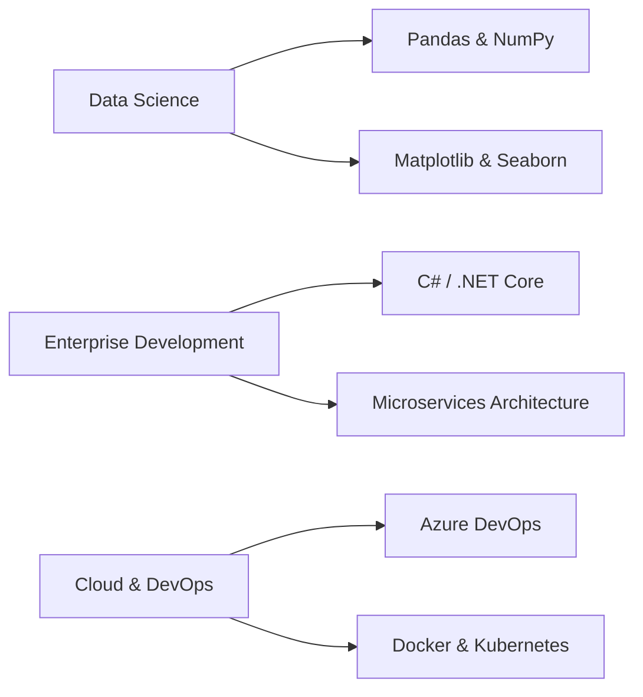

<div align="center">

# Hi, I'm Massine Amakhtari 👋

### Full-Stack Software Engineer | Building Scalable Solutions with AI & Cloud

[](https://www.linkedin.com/in/massine-amakhtari-48b815261/)
[](mailto:massine000@gmail.com)


</div>

---

## 🚀 About Me

I'm a passionate full-stack developer who loves turning complex problems into elegant solutions. With expertise spanning modern web frameworks, cloud services, and mobile development, I specialize in building performant, user-centric applications that scale.

- 🔭 Currently exploring **Data Science** and **Machine Learning** workflows
- 🌱 Deepening my expertise in **C# / .NET** for enterprise solutions
- 💡 Interested in **AI integration**, **cloud architecture**, and **developer tools**
- 🤝 Open to collaborating on impactful open-source projects
- ⚡ Fun fact: I bridge the gap between Python's simplicity and C's performance

---

## 🛠️ Tech Stack

```javascript
const massine = {
    code: ["TypeScript", "Python", "PHP", "C#", "Java", "C", "C++"],
    frontend: {
        frameworks: ["Next.js", "React"],
        styling: ["Tailwind CSS", "Material UI"],
        mobile: ["Android (Java/XML)"]
    },
    backend: {
        python: ["Django", "FastAPI"],
        php: ["Laravel"],
        dotnet: ["ASP.NET Core"],
        node: ["Express"]
    },
    databases: ["PostgreSQL", "MySQL", "Firebase", "MongoDB"],
    cloud: ["Microsoft Azure", "Azure AI Services"],
    tools: ["Git", "Docker", "Postman", "VS Code"],
    currentFocus: ["Data Science", "ML Integration", "Cloud Architecture"]
};
```

---

## 💼 Featured Projects

### 🤖 [Azure AI Student Support](https://github.com/ME-Massine/azure-ai-student-support)
> **Next.js • TypeScript • Azure AI**

An intelligent multilingual support platform leveraging Microsoft Azure AI to democratize educational assistance. Features automated query resolution, real-time language translation, and smart content recommendations.

**Key Highlights:**
- 🌐 Multi-language support for global accessibility
- 🧠 AI-powered intelligent response system
- 📊 Analytics dashboard for tracking support metrics

---

### 🌦️ [SkyCast Weather](https://github.com/ME-Massine/SkyCast)
> **Java • Android • OpenWeather API**

A beautifully designed native Android weather application delivering real-time meteorological data with a focus on UX and performance.

**Key Highlights:**
- 🎨 Material Design 3 implementation
- 🔄 Efficient data fetching with Retrofit
- 📍 Location-based weather forecasting
- 💾 Offline data caching

---

### 💼 [FreelanceHub](https://github.com/ME-Massine/FreelanceHub)
> **Python • Django • PostgreSQL**

A comprehensive project management platform designed for freelancers, featuring secure authentication, milestone tracking, and client communication tools.

**Key Highlights:**
- 🔐 JWT-based authentication system
- 📈 Dynamic project lifecycle management
- 💳 Integrated payment tracking
- 📧 Automated client notifications

---

## 📊 GitHub Analytics

<div align="center">
  
  
</div>

<div align="center">
  
  
</div>

---

## 🎯 Current Learning Path



**2026 Goals:**
- [ ] Master data analysis and visualization libraries
- [ ] Build a production-grade microservices application
- [ ] Contribute to 5+ open-source projects
- [ ] Complete Azure AI certification
- [ ] Launch a SaaS product

---

## 🤝 Let's Connect

I'm always interested in discussing new projects, creative ideas, or opportunities to collaborate. Whether you want to build something amazing together or just chat about technology, feel free to reach out!

<div align="center">

[](https://www.linkedin.com/in/massine-amakhtari-48b815261/)
[](mailto:massine000@gmail.com)
[](https://github.com/ME-Massine)

---


### ⭐️ From [ME-Massine](https://github.com/ME-Massine)

</div>
